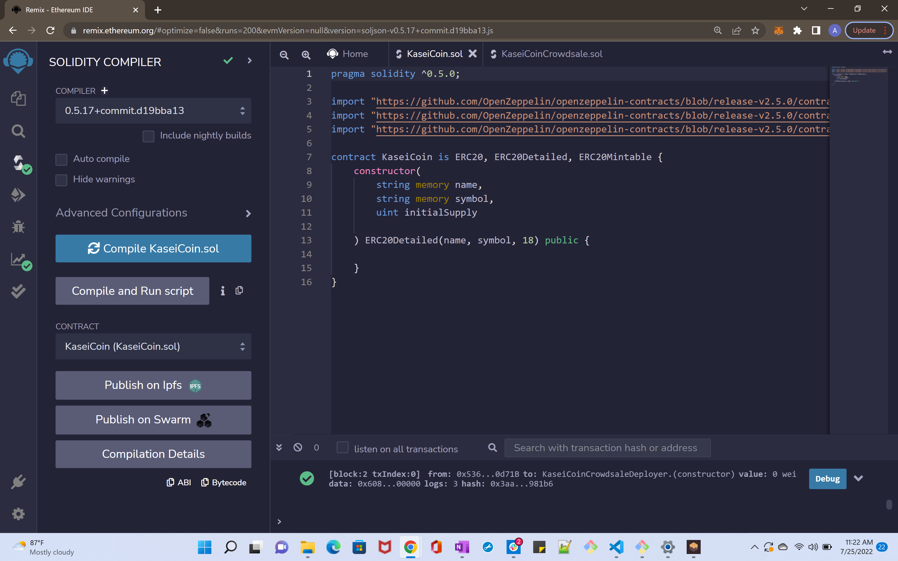
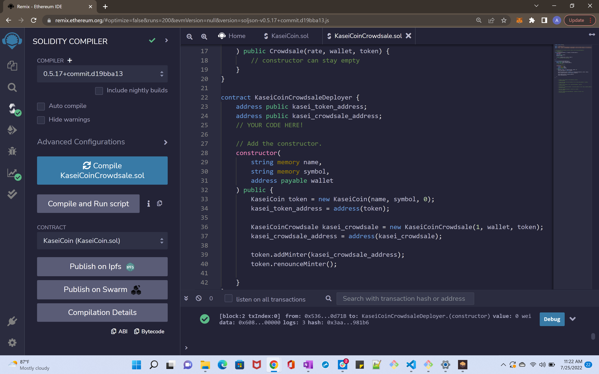
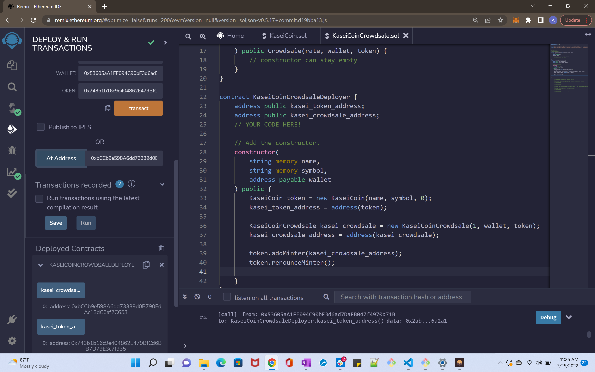
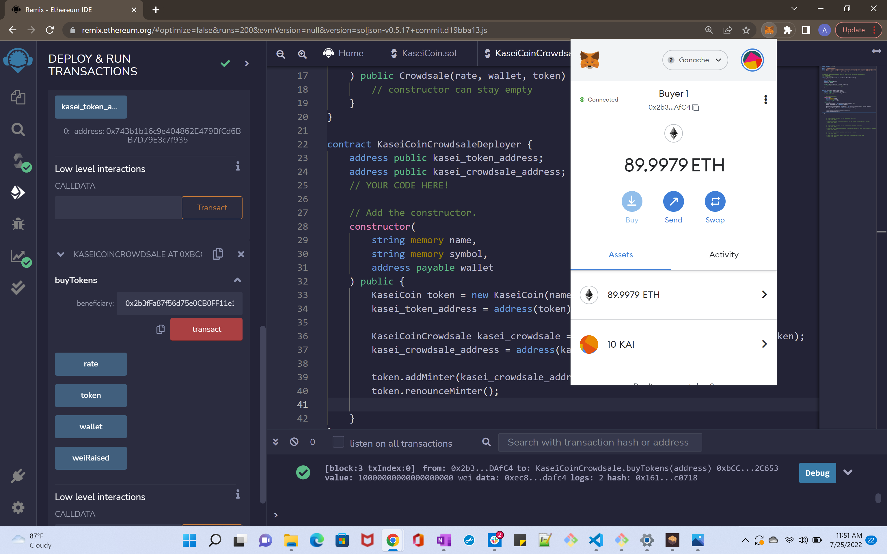
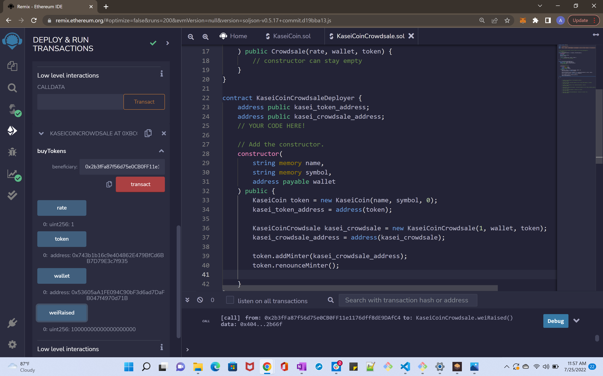
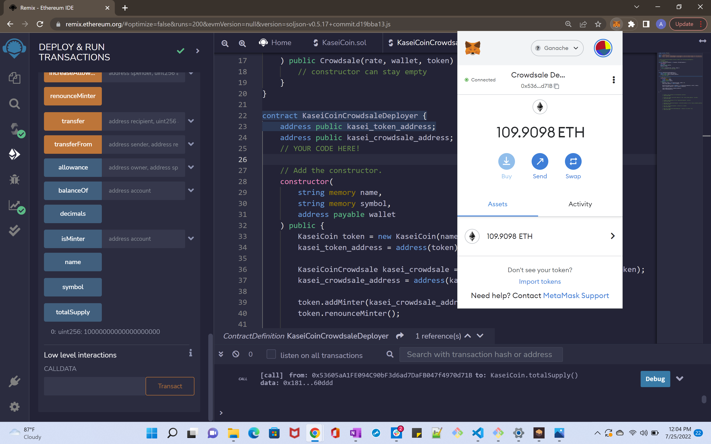

# Martian-Token-Crowdsale

## Launch and test a crowdsale of KaseiCoin (Kasei is Japanese for Mars)

1. Open or copy code from KaseiCoin.sol and KaseiCoinCrowdsale.sol into Remix IDE and compile both files.

- make sure to have ganache accounts imported into MetaMask. 

2. Now go to Deploy & Run Transactions tab in Remix interface. Select Injected Provider - Metamask as environment. Selected account will be the crowdsale owner when deploying. 

3. Switch to Ether and select KaseiCoinCrowdsaleDeplyer contract to launch first. Enter "KaseiCoin" as NAME, "KAI" as SYMBOL, and copy crowdsale owner account address into WALLET. Hit transact and confirm the gas event in Metamask.

4. Next, select the KaseiCoinCrowdsale contract to deploy. Enter 1 for the Rate and again the crowdsale owner address under Wallet. Next find the token address under kasei_token_address of the deployed KaseiCoinCrowdsaleDeployer contract and copy this to the TOKEN field. Similarly, find the crowdsale address under kasei_crowdsale_address of the KaseiCoinCrowdsaleDeployer contract and copy this address in the At Address field. Finally, hit the At Address button to deploy the KaseiCoinCrowdsale contract. 

5. Next, select the KaseiCoin contract, enter the kasei_token_address in the At Address field, and hit the At Address button to deploy. 

### The crowdsale is now live. 
6. Switch to an account in Metamask that will be buying KAI and be sure to first import the token in this Metamask wallet using the same kasei_token_address from before. This buyer account should be reflected in the ACCOUNT field at the top of the Remix interface. Enter the amount of ETH this account will send to the contract in the VALUE field. Copy this buyer's wallet address and scroll down to the deployed KaseiCoinCrowdsale contract and enter this wallet address into the beneficiary field under buyTokens and hit transact. When done successfully, you should see the ETH balance in the wallet reduced by the amount sent to the contract plus the gas fee and the balance of KAI increased by what was received in return. 
### Congratulations! You successfully launched a crowdsale and sold KaseiCoin.  

### Further verify the transactions were successful
1. Under the weiRaised field of KaseiCoinCrowdale contract, you will see this value updated to the equivalent ETH value that has been sent to the contract.
 

2. Under the KaseiCoin contract under deployed contracts check totalSupply at the bottom to see that it is also now updated to show the total supply of KAI minted by the crowdsale. Also see the ETH balance in the crowdsale owner's Metamask wallet reflects ETH sent by buyers to purchase KAI less gas fees. 
